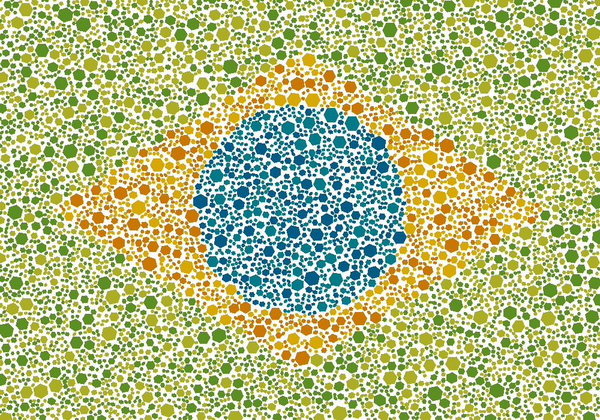

# Draw with Shapes



A simple Python srcipt to draw on top of images using randomly
placed geometric shapes. This was adapted from
[ishihara_generator](https://github.com/franciscouzo/ishihara_generator)
by @franciscouzo

Colours can be applied based on:
* Geometric rules (i.e. by mathematically descrobing a region in 2D space)
* An image on top of which the geometric motive will be generated

## Requirements
* [Pillow](https://pillow.readthedocs.io/en/stable/installation.html)
* [Numpy](https://numpy.org/install/)

The script was tested on Python 3.6.9.

## Usage
```bash
python3 draw_with_shapes.py
```

The script can be interrupted during its execution and the image will still be generated. This feature is included since it's hard to estimate a good number of shapes to use in the image, so manual interruption when the script slows down (due to image filling up) is often necessary.

## Configuration
No CLI options are currently avaliable, though all relevant
settings for a user who doesn't want to dive too deeply into the
code should be located at the top of the script.

If you simply wish to draw over iy, you must set the flag
`DRAW_OVER_IMAGE` to `True` and `DRAW_OVER_IMAGE_PATH` to the
path to the image. It should be noted any pixel which is not
completely black (for images without an alpha layer) or
completely transparent (for images with an alpha layer) will be
drawn over using the same palette according to the current
implementation.

The function `calculate_circle_colour` should be of particular
interest and should be modified if you wish to draw anything
other than the Brazilian flag.

Currently the most obscure setting in the script is how to draw circles. It is done by setting `NUMBER_OF_SIDES_PER_SHAPE` to `None`.

## To-Do's
- [ ] Remove hard coded Brazilian flag drawing
- [ ] Add options for multiple draw over images with multiple different colours
- [ ] Add CLI options
